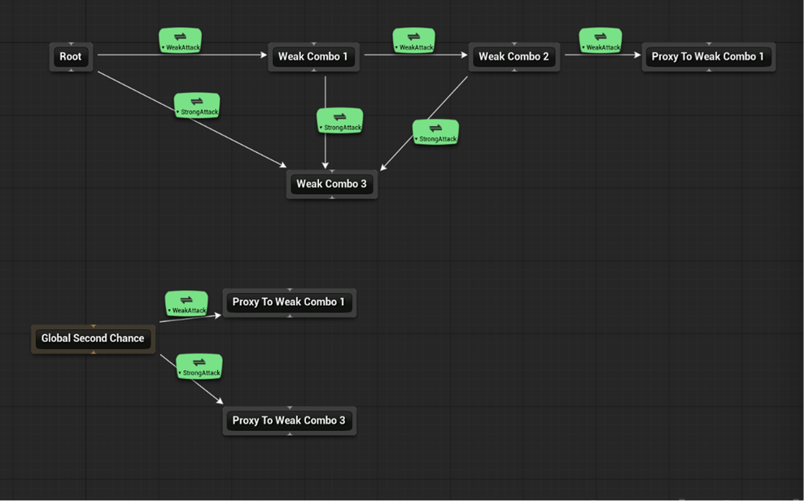

# OverdriveAbility

Unreal Engine 5.8 플러그인. GameplayAbilitySystem 확장 — **그래프 기반 입력 라우팅**, 정책으로 분리한 쿨다운·코스트, EffectContext 프래그먼트.

## 개요

콤보를 if 문으로 짜면 금방 손을 못 대게 된다. 이 플러그인의 중심은 **AbilityRouter** — 입력과 어빌리티의 연결을 그래프 에셋으로 편집하는 시스템이다.

노드가 어빌리티고, 엣지가 "어떤 입력에 어떤 상태에서 넘어갈 수 있는가"다. 현재 발동 중인 어빌리티가 곧 현재 노드이므로, 콤보는 그래프를 따라 걷는 일이 된다.

## 모듈 구성

| 모듈 | 타입 | 역할 |
|---|---|---|
| `OverdriveAbility` | Runtime | 라우터 그래프·컴포넌트, 어빌리티 베이스, 정책, 프래그먼트 |
| `OverdriveAbilityUI` | Runtime | MVVM 뷰모델 |
| `OverdriveAbilityEditor` | Editor | 라우터 그래프 에디터, 에디터 모드 |
| `OverdriveAbilityNodes` | UncookedOnly | EffectContext 프래그먼트 K2Node |

## 주요 기능

### AbilityRouter



*Root에서 WeakAttack / StrongAttack 입력으로 분기하는 콤보 그래프. 아래쪽 `GlobalSecondChance`는 Root의 자식이 아니라 형제라 어느 상태에서든 열려 있다.*

전용 그래프 에디터를 가진 애셋이다. 노드 종류는 넷이다.

| 노드 | 역할 |
|---|---|
| `Root` | 기본 진입점. 아무 어빌리티도 실행 중이 아닐 때의 시작점 |
| `GlobalSecondChance` | 전역 폴백 진입점. 로컬 순회가 실패하면 여기서 한 번 더 찾는다 |
| `Simple` | 어빌리티 하나를 지정하는 일반 노드 |
| `Proxy` | 다른 노드로 넘기는 참조 노드. 그래프가 트리 밖으로 합류할 때 사용 |

`GlobalSecondChance`는 Root의 자식이 아니라 **형제**다. 어느 상태에서든 열려 있어야 하는 대쉬·점프 같은 어빌리티를 여기 매단다.

입력이 들어오면 라우터는 이 순서로 처리한다.

```
입력 차단 확인 → 입력 반응 델리게이트 → 그래프 순회
                                          ├─ CurrentNode의 자식에서 탐색
                                          └─ 실패 시 GlobalSecondChance에서 재탐색
```

### 엣지 조건

엣지는 "어떤 입력에 어떤 상태에서 넘어갈 수 있는가"를 담는다. 판정 항목은 넷이고, **전부 통과해야** 다음 노드로 넘어간다.

| 항목 | 타입 | 판정 |
|---|---|---|
| `bPressed` | `bool` | Press / Release 중 어느 쪽 입력인가 |
| `InputTypeTag` | `FGameplayTag` | 어떤 InputType 입력인가 |
| `ConditionQuery` | `FGameplayTagQuery` | 상태 태그 + ASC 소유 태그가 쿼리에 맞는가 (비어 있으면 통과) |
| `EdgeConditions` | `TArray<TObjectPtr<UOverdriveAbilityRouterEdgeCondition>>` | 모든 조건 오브젝트가 true를 반환하는가 (비어 있으면 통과) |

싼 것부터 순서대로 평가한다: 필드 비교 → 태그 쿼리 → 조건 오브젝트.

### UOverdriveAbilityRouterEdgeCondition

태그로 표현되지 않는 조건 — 어트리뷰트 값 비교, 이동 상태, 타깃 존재 여부 등 — 을 위한 **Instanced 조건 오브젝트**다. 엣지의 `Edge Conditions` 배열에 여러 개를 매달 수 있고, 전부 true여야 통과한다(AND).

`CanEnterEndNode`는 엣지의 판정 함수와 **같은 매개변수**를 받는다. 라우터 컴포넌트가 함께 넘어오므로 오너 액터·ASC·입력 차단 상태 등에 접근할 수 있다.

```cpp
UCLASS()
class UMyRouterCondition : public UOverdriveAbilityRouterEdgeCondition
{
	GENERATED_BODY()

protected:
	virtual bool CanEnterEndNode_Implementation(const UOverdriveAbilityRouterComponent* InRouterComponent, bool bInPressed, const FGameplayTag& InInputTypeTag, const FGameplayTagContainer& InStateTags) const override
	{
		const UAbilitySystemComponent* AbilitySystem = InRouterComponent ? InRouterComponent->GetAbilitySystem() : nullptr;
		return AbilitySystem && AbilitySystem->GetNumericAttribute(UMyAttributeSet::GetStaminaAttribute()) >= 30.0f;
	}
};
```

`BlueprintNativeEvent`라 **블루프린트 서브클래스에서도 오버라이드**할 수 있다. C++ 없이 조건을 추가할 때 쓴다. 기본 구현은 `true`(조건 없음 = 통과)이므로, 오버라이드를 빼먹어도 기존 동작을 막지 않는다.

### 입력 버퍼

매칭에 실패한 Press 입력은 단일 슬롯에 잠시 보관된다(기본 0.2초). 상태 태그가 바뀌어 콤보 창이 열리면 보관된 입력이 재평가되어 발동한다. 창이 열리기 직전에 누른 입력이 씹히지 않게 하기 위한 장치다.

### UOverdriveAbilityRouterComponent

EnhancedInput의 `UInputAction`을 라우터 InputType 태그에 매핑한다. 폰 재시작·빙의 변경을 감지해 바인딩을 다시 건다.

```cpp
// 콤보 창 열기 (보통 애님 노티파이에서)
RouterComponent->AddStateTag(ComboWindowTag);

// 특정 입력 일시 차단
RouterComponent->BlockInputTag(DodgeInputTag);
```

- `AddStateTag` / `RemoveStateTag` — 엣지 조건이 참조하는 상태. 변경 시 버퍼 입력 재평가
  - 엣지 `ConditionQuery`가 실제로 매칭하는 대상은 **이 상태 태그 + ASC 소유 태그**를 합친 집합이다. GE·어빌리티가 붙인 태그(공중/무적/스턴 등)로도 전이 조건을 걸 수 있다
  - 단 `HasStateTag()` / `GetOwnedGameplayTags()`는 컴포넌트 자체 상태 태그만 반환한다
- `UpdateStateTags(TagsToRemove, TagsToAdd)` — 제거 후 추가를 **한 번에** 적용. 하나씩 바꾸면 그 사이에 버퍼 입력이 재평가돼 엉뚱한 엣지로 매칭될 수 있으므로, 콤보 창을 다음 단계로 넘길 때는 이쪽을 쓴다
- `SetStateTags(NewStateTags)` — 상태 태그를 통째로 덮어쓴다. 빈 컨테이너면 전부 해제
- `BlockInputTag` / `UnblockInputTag` — 카운트 기반 입력 차단
- `IsInputPressed(InputType)` — 해당 InputType이 현재 눌려 있는지
- `GetInputReactionDelegate(bPressed, InputType)` — 바인딩하면 해당 입력은 그래프 순회 대신 델리게이트만 실행한다. 차지·홀드처럼 어빌리티가 입력을 직접 소비할 때 사용

#### 애님 노티파이

상태 태그 조작용 노티파이가 함께 제공된다. 몽타주에서 콤보 창을 여닫는 용도다.

| 노티파이 | 동작 |
|---|---|
| `Ability Router: Update State Tags` | `UpdateStateTags` 호출 — 제거 → 추가를 원자적으로 |
| `Ability Router: Set State Tags` | `SetStateTags` 호출 — 통째로 교체 |

### ASC 탐색 전략

라우터 컴포넌트는 붙은 액터에서 ASC를 바로 찾지 못할 수 있다. ASC가 PlayerState에 있으면 폰의 `BeginPlay` 시점엔 아직 `PlayerState`가 null이기 때문이다(스폰 → BeginPlay → Possess 순서).

그래서 탐색을 **전략 클래스로 분리**하고 주기적으로 재시도한다. 컴포넌트의 `AbilitySystemFinderClass`로 고른다.

| 전략 | 찾는 곳 |
|---|---|
| `Finder_Owner` (기본) | 컴포넌트를 소유한 액터 |
| `Finder_Controller` | 오너의 컨트롤러 |
| `Finder_PlayerState` | 오너의 PlayerState |

재시도 주기(`AbilitySystemFindPeriod`)와 최대 횟수(`AbilitySystemFindMaxCount`)도 컴포넌트에서 조절한다. `UOverdriveAbilitySystemFinder`를 상속하면 커스텀 전략을 만들 수 있고, `FindAbilitySystem`이 `BlueprintNativeEvent`라 블루프린트로도 가능하다.

### UOverdriveGameplayAbility

쿨다운과 코스트를 **Instanced 정책 오브젝트**로 분리했다. 어빌리티마다 GE를 새로 만들지 않고 정책만 바꿔 끼운다.

| 정책 | 동작 |
|---|---|
| `CooldownPolicy_Default` | 쿨다운 태그를 ASC가 보유 중이면 차단 |
| `CooldownPolicy_Stack` | 스택형 쿨다운(충전식). 스택이 한도에 닿으면 차단 |
| `CostPolicy_Default` | 기본 코스트 |

`CooldownPolicy_Stack`을 쓰려면 쿨다운 GE가 **`StackingType != None`이고 `StackLimitCount >= 1`**이어야 한다. `StackLimitCount`는 0과 -1이 "무제한"을 뜻하므로 한도를 지정하지 않으면 정책이 성립하지 않는다. 설정 누락은 어빌리티 데이터 검증(`IsDataValid`)에서 에러로 잡힌다.

`Fragments` 배열로 어빌리티에 재사용 가능한 동작 조각을 붙일 수 있다.

Commit 계열은 `FGameplayEventData`를 받는 오버로드가 함께 제공된다(`CommitAbilityWithEvent` 등). 이벤트 페이로드에 따라 코스트·쿨다운이 달라지는 어빌리티를 위한 것이다.

### EffectContext 프래그먼트

`FGameplayEffectContext`에 임의의 구조체를 태그로 붙이고 꺼내는 확장. 전용 K2Node 두 개가 제공된다.

- `Add Context Fragment` — 컨텍스트에 프래그먼트 추가
- `Get Effect Context Fragment` — 타입으로 꺼내기 (와일드카드 핀)

기본 제공으로 `OverdriveEffectContextFragment_Cooldown`이 있다. 쿨다운 정책이 이 프래그먼트를 읽어 절대 시간(`bAbsoluteCoolTime`)이나 SetByCaller 값으로 쿨다운을 덮어쓴다.

> **이 기능은 `UOverdriveAbilitySystemGlobals` 설정을 전제로 한다.** 아래 [설치](#설치) 참고. 설정하지 않으면 프래그먼트가 붙지 않는 정도가 아니라 **정의되지 않은 동작**이 된다.

### 태스크 / 비동기 액션

`WaitInputReaction` — 라우터의 입력 반응 델리게이트를 어빌리티에서 대기한다. AbilityTask와 AsyncAction 두 형태로 제공된다.

### MVVM 뷰모델

| 뷰모델 | 대상 |
|---|---|
| `OAVM_SingleAttribute` | 어트리뷰트 1개 |
| `OAVM_PairedAttribute` | 현재/최대 쌍 (체력바 등) |
| `OAVM_FilteredSingleAttribute` / `OAVM_FilteredPairedAttribute` | 태그로 필터링한 어트리뷰트 |
| `OAVM_ActiveEffect` / `OAVM_ActiveEffectList` | 활성 GameplayEffect 목록(버프 아이콘 등) |

## 요구 사항

- Unreal Engine **5.8**
- 엔진 플러그인: `GameplayAbilities`, `EnhancedInput`, `ModelViewViewModel`

다른 Overdrive 플러그인에는 의존하지 않는다.

## 설치

```bash
cd YourProject/Plugins
git clone https://github.com/Kim-9202/OverdriveAbility.git
```

`.uproject`의 `Plugins` 배열에 추가한 뒤 프로젝트 파일을 재생성하고 빌드한다.

### AbilitySystemGlobals 등록 (필수)

EffectContext 프래그먼트는 커스텀 `FGameplayEffectContext`를 쓴다. 이 컨텍스트가 만들어지려면 `Config/DefaultGame.ini`에 아래를 추가해야 한다.

```ini
[/Script/GameplayAbilities.AbilitySystemGlobals]
AbilitySystemGlobalsClassName=/Script/OverdriveAbility.OverdriveAbilitySystemGlobals
```

GAS는 모든 이펙트 컨텍스트를 `UAbilitySystemGlobals::AllocGameplayEffectContext()`로 만든다. 이 설정이 없으면 엔진 기본 컨텍스트가 생성되고, 프래그먼트 API는 그 메모리를 파생 타입으로 간주해 접근한다.

이미 자체 `UAbilitySystemGlobals` 파생 클래스를 쓰고 있다면, 그 클래스가 `UOverdriveAbilitySystemGlobals`를 상속하거나 `AllocGameplayEffectContext()`에서 `FOverdriveGameplayEffectContext`를 반환하도록 한다.

## 상태

개인 개발 중인 플러그인이다. API는 예고 없이 바뀔 수 있다.

## 라이선스

All rights reserved. 열람 목적으로만 공개한다 — 복제·수정·배포·이용을 허가하지 않는다.
